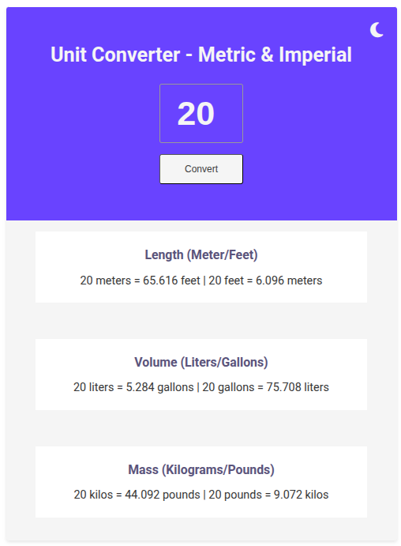
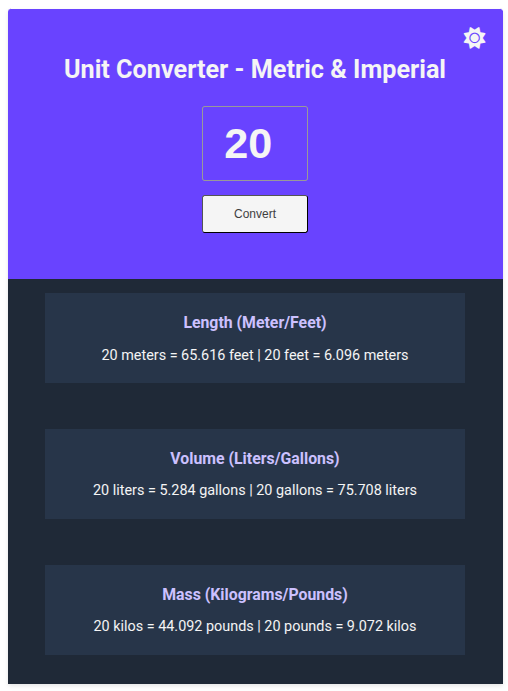

# Metric/Imperial Unit Conversion App

A simple and responsive web app that converts between metric and imperial units for **length**, **volume**, and **mass**. Built with HTML, CSS, and JavaScript.

## 🚀 Features

- 🌡️ Converts:
  - Meters ↔ Feet
  - Liters ↔ Gallons
  - Kilograms ↔ Pounds
- 🌗 Light/Dark mode toggle with a moon/sun icon
- 🧮 Input validation to handle incorrect values
- 📱 Responsive design for different screen sizes
- ⌨️ Press `Enter` or click `Convert` to get results

## 📸 Preview

## 🛠️ Tech Stack

- HTML5
- CSS3 (Flexbox, responsive units)
- JavaScript (DOM manipulation)

## 📂 File Structure

project-folder/
│
├── index.html # Main HTML file
├── index.css # Styling for layout, theming, responsiveness
├── index.js # Logic for conversions and dark mode
└── README.md # Project documentation

markdown
Copiar
Editar

## ⚙️ How to Use

1. Clone or download this repository.
2. Open `index.html` in your browser.
3. Enter a number in the input field and click the **Convert** button.
4. Toggle between light and dark mode using the moon/sun icon.

## 🧪 Example

If you enter `20`, you will get:

- **Length**: `20 meters = 65.616 feet | 20 feet = 6.096 meters`
- **Volume**: `20 liters = 5.284 gallons | 20 gallons = 75.708 liters`
- **Mass**: `20 kilos = 44.092 pounds | 20 pounds = 9.072 kilos`

## 🌙 Dark Mode

Click the 🌙 icon to switch to dark mode — the background and text colors adapt for a better night-time reading experience.

## 📄 License

This project is open source and free to use for personal or educational purposes.